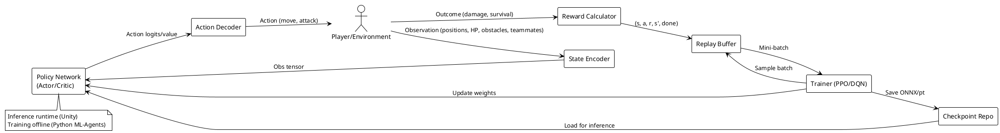

# Chương 1. Tổng quan về game sinh tồn Co-op tích hợp AI kẻ địch dựa trên học tăng cường

## Mở đầu

Chương 1 đặt nền móng cho toàn bộ đề tài, cung cấp cái nhìn tổng quan về sản phẩm game sinh tồn Co-op 1-2 người chơi với kẻ địch được điều khiển bởi AI học tăng cường (Reinforcement Learning). Nội dung chương trình bày các giai đoạn tiền sản xuất (ý tưởng, concept, tài liệu thiết kế game GDD, prototype), phương pháp tiếp cận xây dựng hệ thống (mô hình tổng quát, phương pháp phát triển, công nghệ, kiến trúc), và các kỹ thuật triển khai cụ thể, nhằm thống nhất mục tiêu và phạm vi trước khi đi sâu vào phân tích, thiết kế và thử nghiệm ở các chương sau.

## 1.1. Tiền sản xuất game sinh tồn Co-op

### 1.1.1. Ý tưởng

Chúng em hướng tới một game sinh tồn Co-op 1-2 người với vòng lặp áp lực tăng dần, nơi bầy quái do AI học tăng cường điều khiển có thể thay đổi cách áp sát, chia cắt đội hình và dồn góc theo lối chơi của người chơi. Người chơi phải liên tục phối hợp, chia vai trò và xoay sở trước sự thích ứng của kẻ địch để giữ nhịp sống sót. Đây là ý tưởng hạt nhân dẫn tới các bước concept, GDD và prototype.

### 1.1.2. Concept

Concept xoay quanh vòng lặp “áp lực tăng dần – thích ứng lẫn nhau – phối hợp để sống sót” cho 1-2 người chơi. Mỗi trận, người chơi khởi đầu đơn giản nhưng phải sớm chia vai (dọn lính/khống chế/hỗ trợ) để không vỡ tuyến khi bầy quái do AI học tăng cường điều khiển đổi góc áp sát, chia cắt và dồn góc theo cách phòng thủ. Mục tiêu là giữ nhịp căng nhưng công bằng: kẻ địch linh hoạt vừa đủ để buộc đội phải xoay chiến thuật, đồng thời vẫn tạo cơ hội lật kèo nếu phối hợp tốt.

### 1.1.3. Pintch

"Survivors Co-op 1-2 người, nơi bầy quái do AI học tăng cường điều khiển luôn quan sát và đổi cách áp sát bạn." Mỗi trận là một bài toán mới: quái đổi góc áp sát, chia cắt đội hình và dồn góc theo cách bạn phòng thủ. Người chơi phải chia vai, di chuyển linh hoạt và phối hợp để mở đường thoát hoặc phản công. Hai điểm bán chính: cảm giác bị "theo dõi và thích ứng" từ kẻ địch, và giá trị Co-op khi cả đội cùng đọc tình huống để xoay chuyển cục diện.

### 1.1.4. Tài liệu thiết kế game (GDD - Game Design Document)

#### 1.1.4.1. Tên game

- Tên: Vampire Survivors.
- Nền tảng: PC (Unity build), có thể mở rộng sang mobile/web.
- Engine: Unity (2D).

#### 1.1.4.2. Overview / High Concept

Game roguelite survival action 2D top-down với lối chơi "auto-attacker". Người chơi điều khiển nhân vật di chuyển để sống sót qua hàng sóng quái vật ngày càng đông đúc. Vũ khí tấn công tự động, người chơi chỉ cần né tránh và thu thập kinh nghiệm để lên level, chọn power-up.

Core Fantasy: Bắt đầu yếu ớt -> dần trở thành "cỗ máy hủy diệt" màn hình đầy quái vật, tạo cảm giác gia tăng sức mạnh rõ rệt cho người chơi.

Thể loại: Roguelite, Survival, Bullet Heaven (reverse bullet hell), Auto-shooter.

Đối tượng mục tiêu: Người chơi casual thích game addictive, chơi ngắn (15-30 phút/run), fan của Vampire Survivors, HoloCure, Soul Knight, v.v.

#### 1.1.4.3. Gameplay Core Loop

- Chuẩn bị: Chọn nhân vật, stage (nếu có nhiều).
- Chơi chính:
  - Nhân vật di chuyển tự do (WASD hoặc analog stick).
  - Vũ khí tấn công tự động hướng về quái gần nhất.
  - Quái vật spawn liên tục từ các hướng, số lượng và sức mạnh tăng dần theo thời gian.
  - Giết quái -> rơi XP gems -> thu thập tự động khi gần -> lên level -> chọn 1 trong các lựa chọn vũ khí/passive mới hoặc upgrade cũ.
  - Thu thập gold/chest để unlock permanent upgrade.
- Kết thúc run: Sống sót đến hết thời gian stage (thường 15-30 phút) -> đối mặt boss cuối (Reaper-like) -> chết -> nhận gold để unlock meta-progression.
- Replayability: Mỗi run khác nhau nhờ random level-up choices, unlock mới dần mở ra.

#### 1.1.4.4. Mechanics Chi Tiết

- Movement: Chỉ di chuyển, không aim/bắn thủ công (giữ simplicity).
- Weapons & Evolutions:
  - Vũ khí cơ bản: Whip, Magic Wand, Axe, Cross, Garlic, Santa Water, Bible, Fire Wand, etc.
  - Mỗi vũ khí có cooldown, area/damage/projectile riêng.
  - Evolution: Kết hợp vũ khí + passive item cụ thể ở max level -> vũ khí mạnh hơn (ví dụ: Whip + Hollow Heart -> Bloody Tear).
- Passive Items: Tăng stat (Might, Armor, Recovery, Magnet, etc.).
- Level Up: Max 6 slot (vũ khí + passive). Khi đầy -> chỉ upgrade existing.
- Enemies: Hàng trăm loại (bats, skeletons, ghosts, plants, bosses mini). Spawn wave tăng dần, hướng từ ngoài màn hình vào player.
- Stages: Bản đồ lớn, scroll infinite hoặc fixed với background khác nhau (forest, library, dairy plant, etc.). Có thể thêm Hyper mode (nhanh hơn, reward tốt hơn).
- Meta Progression: PowerUp permanent (tăng HP, damage global, etc.) mua bằng gold kiếm được từ run.

#### 1.1.4.5. Characters

- Nhiều nhân vật unlockable, mỗi cái có starting weapon/stat khác nhau (ví dụ: Antonio khởi đầu với Whip, Imelda với Magic Wand).
- Unlock bằng gold hoặc achievement.

#### 1.1.4.6. Progression & Unlock

- Short-term: Trong run -> level up, evolve weapons.
- Long-term: Unlock new characters, weapons, stages, và arcanas (nếu implement).
- Achievement system để khuyến khích thử thách.

#### 1.1.4.7. UI/UX

- Màn hình chính: Character select, Stage select, Unlock tree.
- In-game: Health bar, timer, level bar, minimap (nếu có), list weapons/passives hiện tại.
- Level up screen: Pause thời gian ngắn, chọn từ 3-4 options.
- Death screen: Summary score, gold earned.

#### 1.1.4.8. Art & Audio

- Style: Pixel art 2D retro (giống game gốc).
- Assets: Sử dụng free/paid asset từ Unity Store hoặc tự vẽ (trong repo có thể đã có sprite enemies, characters).
- Sound: Nhạc nền gothic/chiptune căng thẳng, SFX bắn, explode, level up thỏa mãn.

#### 1.1.4.9. Technical Notes

- Unity 2D Physics cho collision.
- Object pooling cho enemies/weapons để optimize performance (hàng nghìn object trên màn).
- Script chính: PlayerController (movement + magnet), WeaponSystem (auto-fire), EnemySpawner, LevelManager.

### 1.1.5. Prototype

Prototype được xây dựng nhằm kiểm chứng tính khả thi của ý tưởng. Ở giai đoạn này, game tập trung vào các chức năng cốt lõi như:

- Gameplay sinh tồn cơ bản
- Môi trường và kẻ địch đơn giản
- Tích hợp thử nghiệm mô hình học tăng cường

Prototype cho phép đánh giá sớm hiệu năng suy luận của mô hình RL trong thời gian thực, cũng như khả năng tương tác giữa gameplay và hệ thống AI.

## 1.2. Phương pháp tiếp cận xây dựng game sinh tồn Co-op

### 1.2.1. Mô hình tổng quát hệ thống

**Kiến trúc phân lớp (Layered Architecture)**

- Presentation: UI/HUD, input, menu; Unity UI Toolkit, TextMesh Pro.
- Game Logic: combat, cooldown, spawn, collision; C# + 2D Physics.
- AI & Learning: state encoding, reward, RL inference/training; ML-Agents.
- Networking: sync trạng thái, server authority, latency compensation; Netcode.
- Data Persistence: save tiến độ, thống kê, leaderboard; SQLite/PostgreSQL.

**Phụ thuộc hệ thống (System Dependencies)**

- Unity 2022 LTS, New Input System, 2D Box2D, TextMesh Pro.
- ML-Agents Toolkit (PPO/DQN), PyTorch/TensorFlow (training).
- Netcode for GameObjects (RPC, server-authoritative).
- SQLite (local), PostgreSQL/Redis (cloud/caching).

**Tương tác chính giữa thành phần**

- GameManager điều phối vòng lặp; gọi PlayerManager, EnemyManager.
- EnemyManager nhận quyết định từ RL System, phối hợp Spawn/Combat.
- NetworkManager đồng bộ player/enemy state; dự đoán client + reconcile.
- Persistence lưu Player/Session, checkpoint mô hình, leaderboard.

**Tính mô-đun & liên kết (Modularity & Coupling)**

- Loose coupling qua interface/event; high cohesion theo domain.
- Áp dụng Dependency Injection; event-bus để giảm gọi trực tiếp.

### 1.2.2. Phương pháp xây dựng phần mềm

**Quy trình phát triển**

- Agile/Iterative với sprint 1-2 tuần, tập trung từng lớp trong mô hình tổng quát.
- MVP tiếp cận từ dưới lên: Game Logic (core loop) → AI & Learning (RL) → Presentation (UI/Input) → Networking (Co-op) → Data Persistence.
- Feedback loop: playtest sớm, điều chỉnh gameplay/AI dựa trên kết quả thực nghiệm.

**Quản lý mã nguồn**

- Git: main (stable), dev (integration), feature branches theo từng lớp (feat/presentation, feat/ai-learning, v.v.).
- Pull Request + code review; commit theo chuẩn Conventional Commits (feat/fix/refactor).

**Testing theo lớp**

- **Game Logic**: Unit tests (combat, spawn, cooldown), integration tests (PlayerManager ↔ EnemyManager).
- **AI & Learning**: Validate state encoding, reward function; TensorBoard metrics (reward curve, episode length).
- **Presentation**: Manual UI/UX testing, input responsiveness.
- **Networking**: Latency test, reconciliation correctness, multi-client sync.
- **Data Persistence**: Save/load integrity, performance profiling.

**Giai đoạn phát triển**

1. **Prototype**: Game Logic + baseline AI (scripted).
2. **RL Integration**: AI & Learning layer, training pipeline.
3. **Co-op**: Presentation (split-keyboard/HUD) + Networking.
4. **Persistence & Polish**: Data layer, balance, optimization.

### 1.2.3. Công nghệ xây dựng game

Công nghệ được chọn theo từng lớp trong mô hình tổng quát:

| Lớp                  | Công nghệ                                           | Vai trò                                           |
| -------------------- | --------------------------------------------------- | ------------------------------------------------- |
| **Presentation**     | Unity UI Toolkit, TextMesh Pro, New Input System    | Render UI/HUD, xử lý input 1-2 người chơi         |
| **Game Logic**       | C# (.NET), Unity 2D Physics (Box2D), Object Pooling | Logic combat/spawn, collision, quản lý entities   |
| **AI & Learning**    | ML-Agents Toolkit (Release 20+), PyTorch/TensorFlow | Training RL policy (PPO), inference runtime       |
| **Networking**       | Netcode for GameObjects, Unity Transport            | Sync state, RPC, client prediction/reconciliation |
| **Data Persistence** | SQLite (local), PostgreSQL (cloud optional)         | Lưu session, checkpoint model, leaderboard        |

### 1.2.4. Kiến trúc phần mềm

Kiến trúc chi tiết cho từng lớp:

**Presentation Layer**

- **Pattern**: MVC (Model-View-Controller).
- **Components**: UIManager (controller), HUDView (display health/timer), InputManager (split-keyboard).
- **Giao tiếp**: Subscribe event từ Game Logic (player state change) để cập nhật HUD.

**Game Logic Layer**

- **Pattern**: Component-based (Unity ECS-style), Event-driven.
- **Core systems**: GameManager (điều phối), PlayerManager, EnemyManager, SpawnManager, CombatSystem.
- **Decoupling**: EventBus để publish/subscribe events (player death, enemy spawn, level up).

**AI & Learning Layer**

- **Pattern**: Strategy Pattern (chính sách RL runtime có thể swap).
- **Components**: RLInferenceEngine (load .onnx model), StateEncoder (quan sát → vector), RewardCalculator.
- **Training**: Offline bằng ML-Agents Trainer (Python), xuất model ONNX cho Unity.

**Networking Layer**

- **Pattern**: Client-Server với server-authoritative.
- **Components**: NetworkManager (tick sync), ClientPredictor (local rollback), ServerAuthority (validate actions).
- **Protocols**: RPC cho command, NetworkVariable cho state sync.

**Data Persistence Layer**

- **Pattern**: Repository Pattern.
- **Components**: PersistenceManager (facade), PlayerRepository, SessionRepository, ModelCheckpointRepository.
- **Storage**: SQLite cho local (player progress), PostgreSQL optional cho cloud (leaderboard).

## 1.3. Đề xuất các kỹ thuật triển khai trong game sinh tồn Co-op

### 1.3.1. Mô hình RL tổng quát (luồng xử lý)

### 1.3.2. Kỹ thuật RL áp dụng

- **PPO (ưu tiên)**: Actor-Critic ổn định cho môi trường multi-agent; lr 3e-4, batch 256, epochs 3-5, clip 0.2, γ=0.99, GAE λ=0.95; cấu hình `ppo_vampire.yaml` với time_horizon 128, summary_freq 10000.
- **DQN (baseline/so sánh)**: State ~32 dims (vị trí player/enemy, HP chuẩn hóa, vật cản, khoảng cách đồng đội); action rời rạc 9 (8 hướng + attack) hoặc liên tục 3D; replay buffer 50k, batch 256, target update mỗi 1000 step, ε-greedy 1.0→0.05 trong 10k episode.
- **Multi-agent shared policy**: Một policy cho các quái cùng loại; phối hợp qua reward shaping (bonus khi focus target/flank/chia aggro) và optional kênh communication 4D (direction_to_mate, intent).
- **Curriculum & transfer**: Bắt đầu 1v1, tăng số quái/độ khó; pretrain map đơn giản, fine-tune map phức tạp; warm-start copy layer đầu từ melee sang ranged.
- **Reward shaping**: +survival per frame, +distance tối ưu (1.5–2.5m), +damage dealt, +combo/flank; phạt damage_taken, ra khỏi vùng hợp lệ, chết. Tránh xung đột thưởng/phạt bằng cách tách rõ nguồn reward.
- **Inference tối ưu**: ONNX + Barracuda; FPS mục tiêu ~60, latency <10ms; AI LOD: quái gần dùng full policy 10 Hz, xa dùng tần suất thấp hoặc scripted fallback.

### 1.3.3. Phối hợp RL với gameplay Co-op

- **Tích hợp theo 5 lớp**: Presentation lấy input; Game Logic gọi StateEncoder/Policy cho enemy; Networking đồng bộ nếu online; Data Persistence lưu checkpoint/telemetry.
- **Client-server**: Server authoritative; client chỉ gửi input, server phát snapshot; client prediction + reconciliation để mượt.
- **Co-op signals**: Ping/marker, shared objectives, team bonus được encode vào observation (team_target) để policy học phối hợp.
- **Balancing động**: Kết hợp RL policy với DDA; nếu người chơi áp đảo, tăng spawn/elite; nếu yếu, giảm aggro range.
- **Telemetry & A/B**: Log reward/episode metrics, so sánh RL vs scripted; feature flags (rl_enabled, reward_version) để thử nghiệm an toàn.
