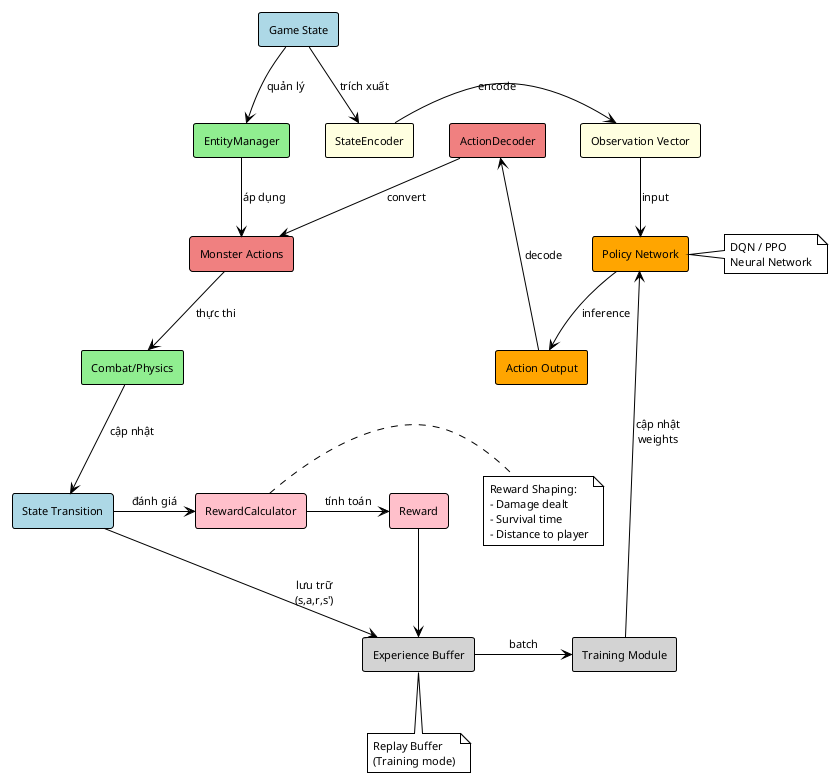
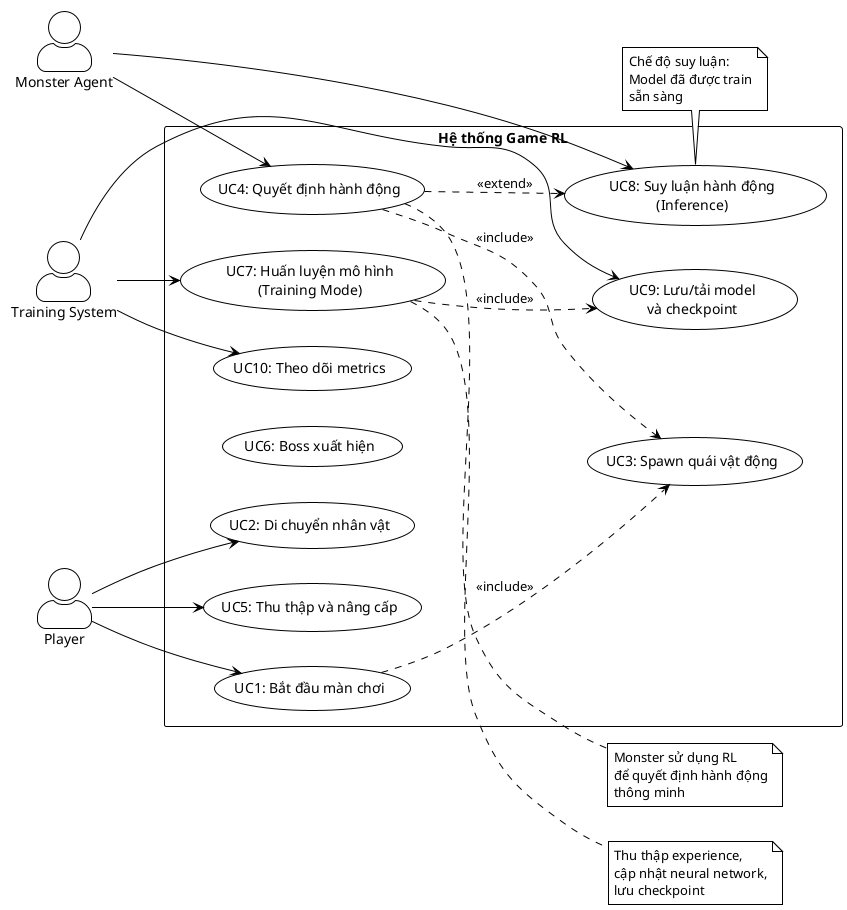
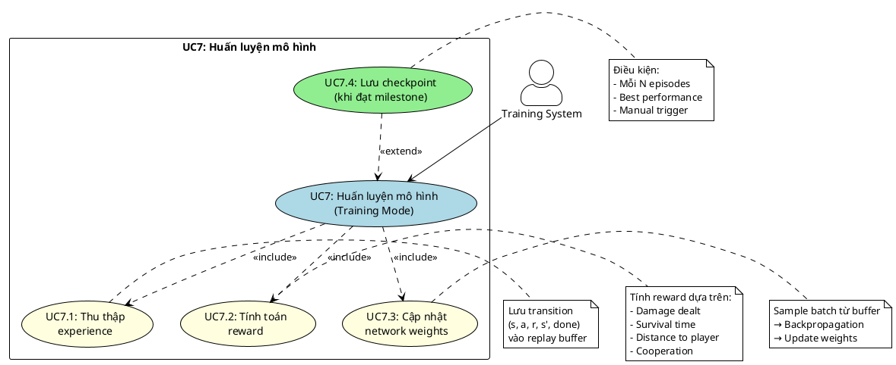
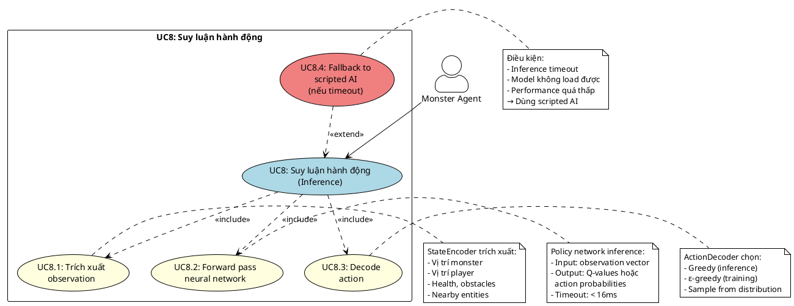
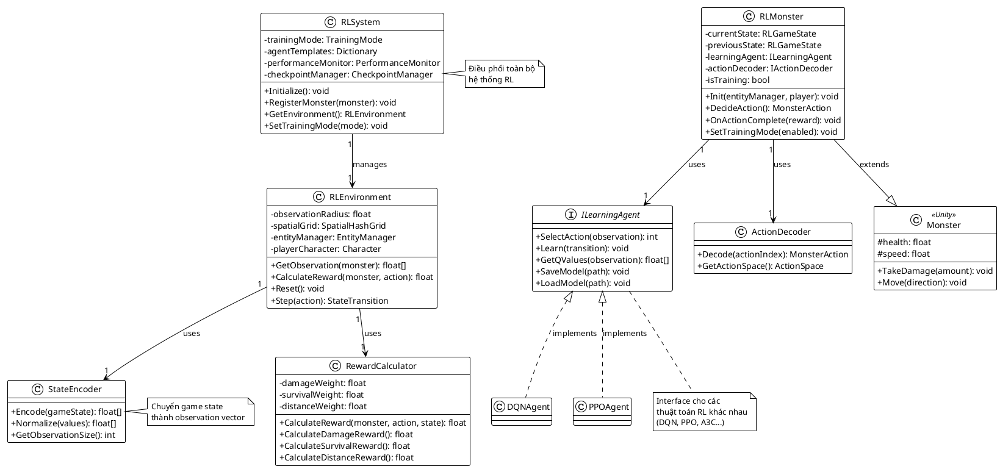
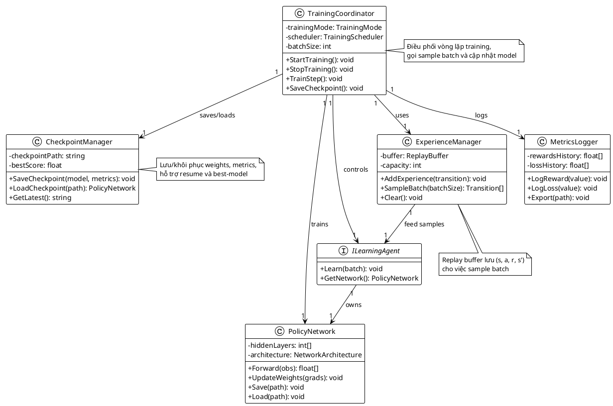
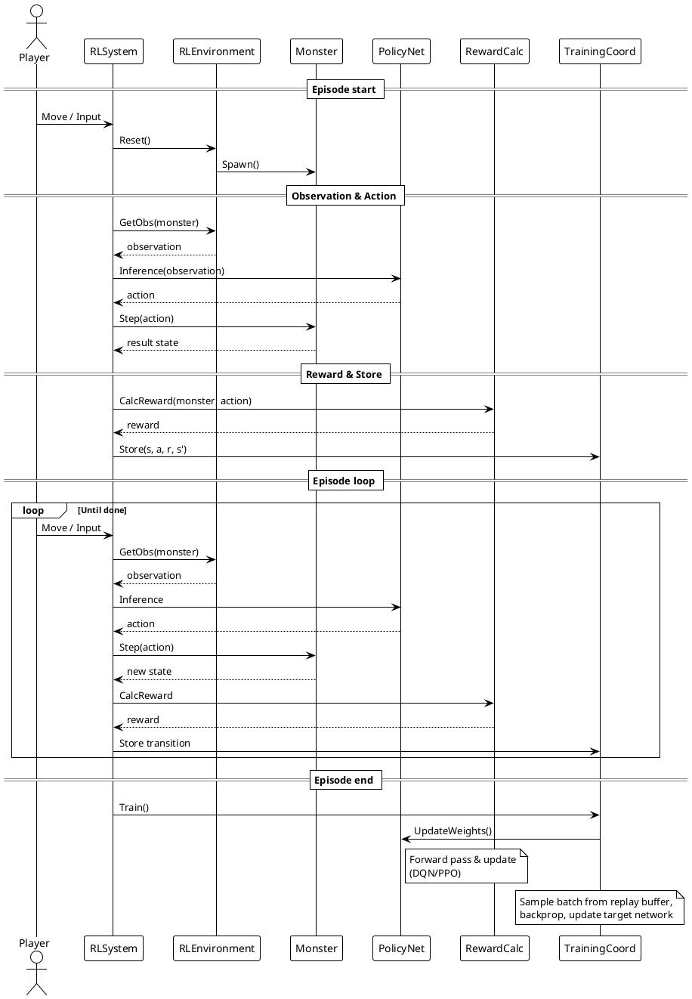
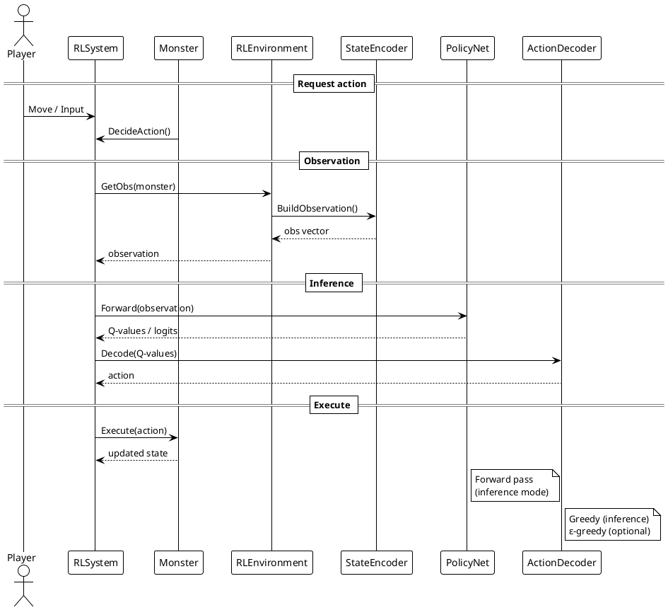
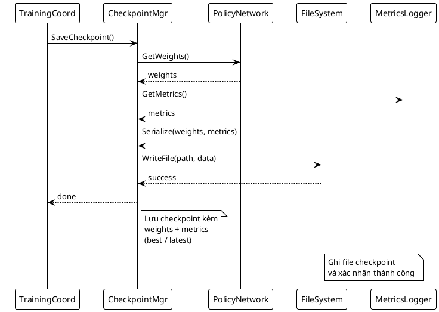

# 2.1. Phân tích hệ thống

## 2.1.1. Kiến trúc phân lớp

Hệ thống áp dụng kiến trúc phân lớp (Layered Architecture) kết hợp với Component-based (Unity):

**Lớp 1 - Presentation Layer:**

- UI/HUD/Input handling
- Hiển thị thông tin game state
- Nhận input người chơi

**Lớp 2 - Game Logic Layer:**

- EntityManager, GameManager, LevelManager
- Quản lý gameplay, combat, spawning
- Xử lý game rules

**Lớp 3 - AI & RL Layer:**

- RLSystem, RLEnvironment, Agents
- Training và Inference
- Reward calculation

**Lớp 4 - Networking Layer:**

- Communication với external training server (tùy chọn)

**Lớp 5 - Data Persistence Layer:**

- Save/Load checkpoint
- Model versioning

## 2.1.2. Phân tích thành phần Front-end (Unity Client)

**Nhiệm vụ:**

- Render game objects (player, monsters, effects)
- Thu thập input
- Hiển thị HUD/UI
- Gọi RL inference qua RLSystem

**Thành phần chính:**

- `Character`: Nhân vật người chơi
- `Monster`: Base class cho quái vật
- `EntityManager`: Quản lý tất cả entity
- `SpatialHashGrid`: Tối ưu spatial queries
- UI Controllers (MainMenuController, HUDController)

## 2.1.3. Phân tích thành phần Back-end (RL Logic)

**Luồng xử lý RL:**



**Thành phần chính:**

1. **RLSystem**: Điều phối toàn bộ RL components
2. **RLEnvironment**: Quản lý game state, observation
3. **StateEncoder**: Chuyển game state → vector
4. **Policy Network**: Neural network quyết định action
5. **ActionDecoder**: Chuyển action index → MonsterAction
6. **RewardCalculator**: Tính reward dựa trên events
7. **TrainingCoordinator**: Quản lý training loop
8. **CheckpointManager**: Save/load models
9. **BehaviorProfileManager**: Quản lý behavior profiles

## 2.1.4. Biểu đồ Use Case

**Hình 2.1: Biểu đồ Use Case tổng quát**



**Hình 2.2: Use Case phân rã - Huấn luyện mô hình (UC7)**



**Hình 2.3: Use Case phân rã - Suy luận hành động (UC8)**



## 2.1.5. Kịch bản (Scenarios)

### Scenario UC7: Huấn luyện mô hình

| **Bước** | **Actor**       | **Hành động**                    | **Hệ thống**                            |
| -------- | --------------- | -------------------------------- | --------------------------------------- |
| 1        | Training System | Khởi tạo episode mới             | Reset environment, spawn monsters       |
| 2        | Monster Agent   | Quan sát trạng thái              | StateEncoder trích xuất observation     |
| 3        | Monster Agent   | Request action từ policy         | Policy network inference → action       |
| 4        | Monster Agent   | Thực thi action                  | Apply action to monster movement/attack |
| 5        | System          | Cập nhật physics & combat        | EntityManager xử lý va chạm, damage     |
| 6        | System          | Tính reward                      | RewardCalculator tính reward            |
| 7        | Training System | Lưu experience                   | Lưu (s, a, r, s', done) vào buffer      |
| 8        | Training System | Lặp bước 2-7 cho đến hết episode | -                                       |
| 9        | Training System | Cập nhật mô hình                 | Sample batch, tính loss, backprop       |
| 10       | Training System | Lưu checkpoint (mỗi N episodes)  | CheckpointManager save model            |

### Scenario UC8: Suy luận hành động

| **Bước** | **Actor**      | **Hành động**       | **Hệ thống**                               |
| -------- | -------------- | ------------------- | ------------------------------------------ |
| 1        | Monster Agent  | Yêu cầu action      | RLMonster.RequestAction()                  |
| 2        | RLEnvironment  | Trích xuất state    | GetObservation(monster)                    |
| 3        | Policy Network | Inference           | Forward pass → Q-values hoặc policy logits |
| 4        | ActionDecoder  | Chọn action         | Greedy select hoặc sample                  |
| 5        | Monster Agent  | Thực thi action     | Move/Attack/Retreat                        |
| 6        | System         | Cập nhật game state | EntityManager.Update()                     |

### Scenario UC9: Lưu/Tải model

| **Bước** | **Actor**         | **Hành động**           | **Hệ thống**                               |
| -------- | ----------------- | ----------------------- | ------------------------------------------ |
| 1        | Training System   | Trigger save checkpoint | CheckpointManager.SaveCheckpoint()         |
| 2        | CheckpointManager | Serialize model weights | Convert weights → binary/JSON              |
| 3        | CheckpointManager | Lưu metadata            | Save version, timestamp, metrics           |
| 4        | CheckpointManager | Ghi file                | Save to disk (models/checkpoint_XXXX.ckpt) |
| ...      | ...               | **Khi load:**           | ...                                        |
| 5        | RLSystem          | Request load checkpoint | CheckpointManager.LoadCheckpoint(path)     |
| 6        | CheckpointManager | Đọc file                | Deserialize weights + metadata             |
| 7        | CheckpointManager | Khôi phục model         | Apply weights to policy network            |

## 2.1.6. Biểu đồ lớp phân tích

**Hình 2.4: Class Diagram - Core RL Components**



**Hình 2.5: Class Diagram - Training Components**



## 2.1.7. Biểu đồ tuần tự

**Hình 2.6: Sequence Diagram - UC7 Training Episode**



**Hình 2.7: Sequence Diagram - UC8 Inference Mode**



**Hình 2.8: Sequence Diagram - UC9 Save Checkpoint**



## 2.1.8. Phân tích quản lý model (Model Management)

**Chức năng chính:**

1. **Checkpoint Management**

   - Auto-save mỗi N episodes
   - Save best model theo performance
   - Version tracking (SemVer)

2. **Model Registry**

   - Quản lý nhiều model cho các monster types khác nhau
   - Policy selection runtime

3. **Fallback & Recovery**

   - Fallback về scripted AI nếu model kém
   - Timeout protection cho inference
   - Auto-recovery khi training crash

4. **Export & Deployment**
   - Export ONNX format
   - Unity Barracuda integration
   - Quantization cho mobile

## 2.1.9. Phân tích episode loop

**Luồng xử lý episodic training:**

```
Episode Start:
  1. Reset environment (spawn monsters, reset player)
  2. Initialize episode state

Episode Loop (mỗi frame):
  3. Observe state → encode
  4. Policy inference → action
  5. Execute action
  6. Calculate reward
  7. Store transition
  8. Check done condition

Episode End:
  9. Sample batch from buffer
  10. Train network (backprop)
  11. Update target network (nếu DQN)
  12. Log metrics
  13. Save checkpoint (nếu cần)
  14. Quay lại bước 1 (episode mới)
```

**Điều kiện kết thúc episode:**

- Player chết
- Timeout (vượt quá thời gian tối đa)
- Đạt mục tiêu (nếu có)

---

**Tóm tắt:** Phần 2.1 phân tích chi tiết kiến trúc phân lớp, các thành phần front-end/back-end, use cases với scenarios, biểu đồ lớp và tuần tự. Tất cả hình đã được đánh số (Hình 2.1 - 2.8).
