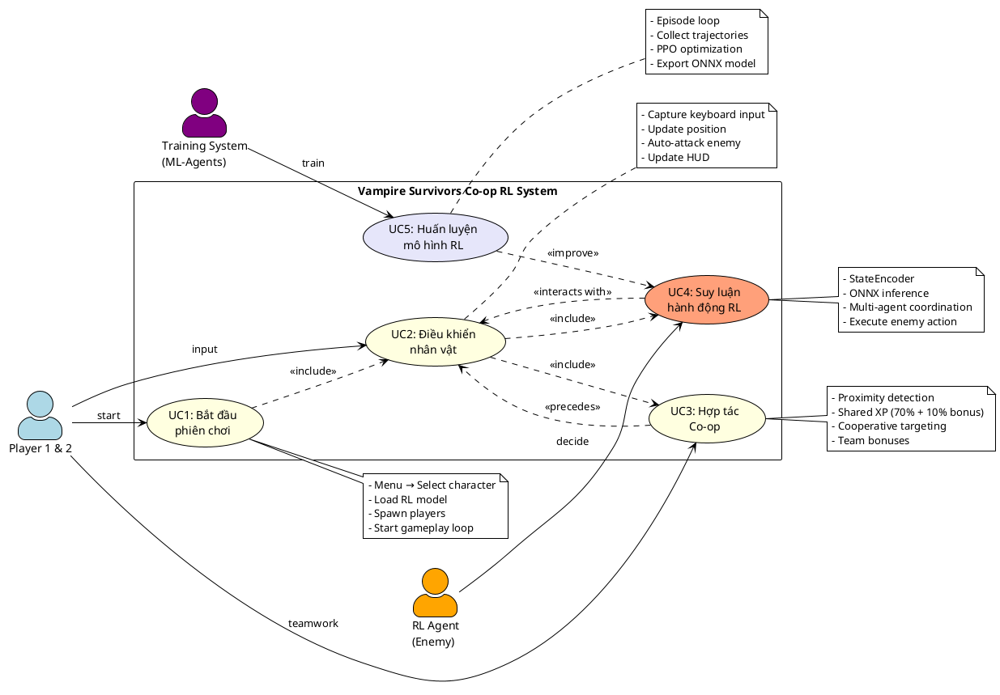
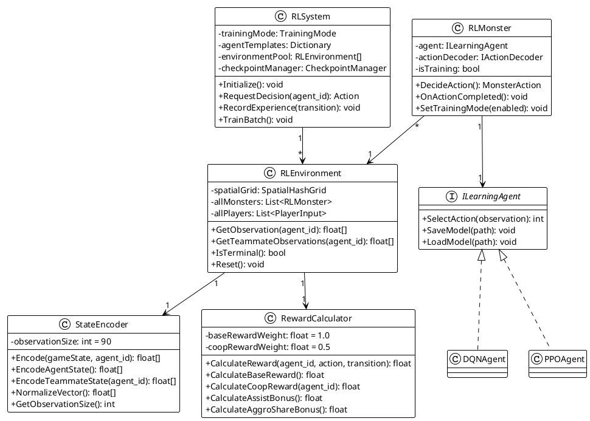
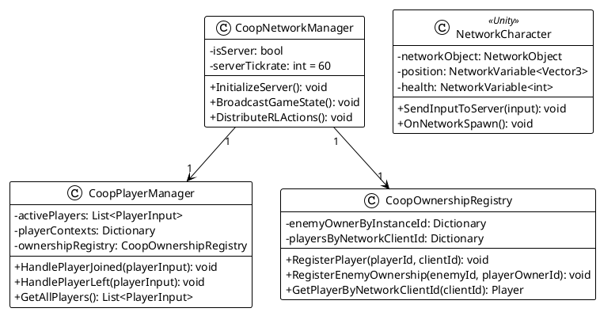
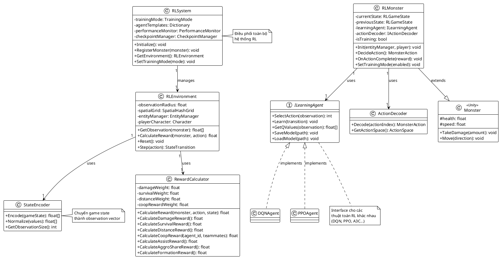
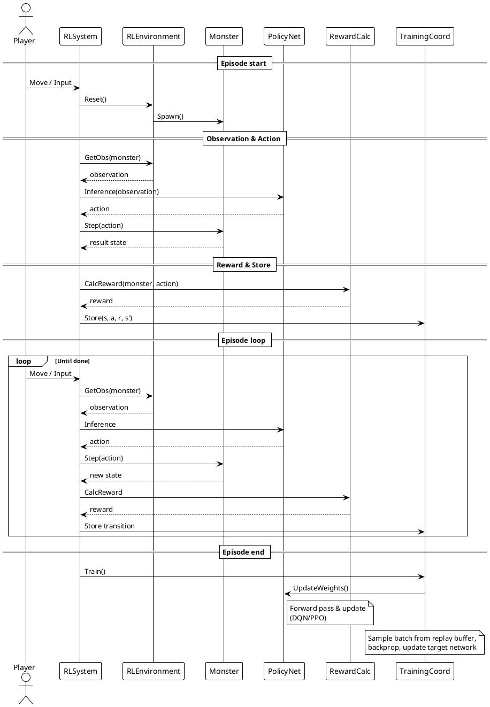
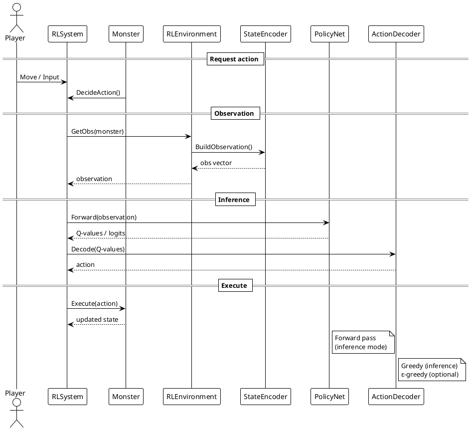
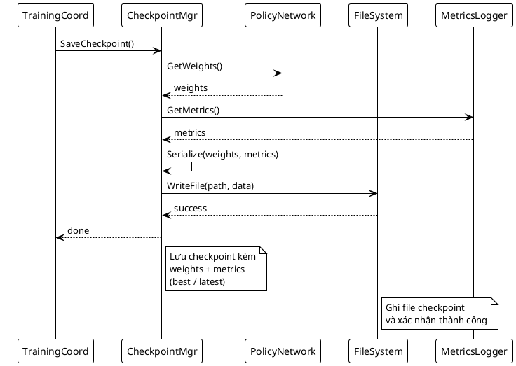

# 2.1. Phân tích hệ thống

Chương này phân tích hệ thống dựa trên kiến trúc 5 lớp đã định nghĩa ở **1.2.1**, bao gồm: Presentation, Game Logic, AI & Learning, Networking, và Data Persistence. Phân tích tập trung vào các actor, use case, kịch bản và tương tác giữa các thành phần trong từng lớp.

## 2.1.1. Xác định Actor và Người dùng chính

### Actor chính

**Người chơi (Player - 1-2 người)**

- **Vai trò**: Điều khiển nhân vật, hợp tác với người chơi khác (nếu có) để sinh tồn qua các wave quái.
- **Tương tác**: Input di chuyển/tấn công, nhận feedback từ UI/HUD, phối hợp với teammate.
- **Lớp liên quan**: Presentation (Input/HUD), Game Logic (PlayerManager), Networking (sync state).

**Hệ thống RL (RL Agent)**

- **Vai trò**: Điều khiển bầy quái thông qua policy đã huấn luyện, đưa ra quyết định hành động real-time dựa trên trạng thái game.
- **Tương tác**: Quan sát state (vị trí players/enemies), tính toán action (di chuyển/tấn công), phối hợp multi-agent.
- **Lớp liên quan**: AI & Learning (RLInferenceEngine, StateEncoder, RewardCalculator).

**Server (trong chế độ Co-op)**

- **Vai trò**: Quản lý authoritative game state, validate actions, đồng bộ hóa giữa clients.
- **Tương tác**: Nhận input từ clients, broadcast state updates, reconcile conflicts.
- **Lớp liên quan**: Networking (NetworkManager, ServerAuthority).

**Training System (Offline)**

- **Vai trò**: Huấn luyện RL policy bằng ML-Agents, lưu checkpoint models.
- **Tương tác**: Chạy episodes mô phỏng, thu thập trajectories, optimize policy, xuất ONNX model.
- **Lớp liên quan**: AI & Learning (training pipeline), Data Persistence (model checkpoint).

### Người dùng chính

**End User (Người chơi cuối)**

- **Mục tiêu**: Trải nghiệm gameplay sinh tồn với AI kẻ địch thông minh, chơi đơn hoặc co-op với bạn bè.
- **Kỳ vọng**: Gameplay mượt mà, kẻ địch thách thức nhưng công bằng, phối hợp co-op có ý nghĩa.

**Developer/Trainer (Nhà phát triển)**

- **Mục tiêu**: Huấn luyện và tinh chỉnh RL policy, cân bằng gameplay, debug và optimize.
- **Kỳ vọng**: Pipeline training ổn định, metrics rõ ràng, dễ dàng thử nghiệm hyperparameters.

### Phân loại Actor theo lớp kiến trúc

| Lớp                  | Actor/Thành phần                                  | Vai trò                                    |
| -------------------- | ------------------------------------------------- | ------------------------------------------ |
| **Presentation**     | InputManager, UIManager, HUDView                  | Nhận input từ Player, hiển thị feedback    |
| **Game Logic**       | PlayerManager, EnemyManager, GameManager          | Điều phối gameplay, quản lý entities       |
| **AI & Learning**    | RLInferenceEngine, StateEncoder, RewardCalculator | Suy luận policy, encode state, tính reward |
| **Networking**       | NetworkManager, ClientPredictor, ServerAuthority  | Đồng bộ multi-player, validate actions     |
| **Data Persistence** | PersistenceManager, ModelCheckpointRepo           | Lưu/load progress, checkpoint RL models    |

## 2.1.2. Biểu đồ Use Case Tổng Quát

Biểu đồ Use Case mô tả 5 use case chính giữa các actor (Player, RL Agent, Training System) với hệ thống game sinh tồn Co-op tích hợp RL.

**Hình 2.1: Use Case tổng quát - Hệ thống Game Sinh Tồn Co-op với RL (5 Use Cases Chính)**



## 2.1.3. Kịch bản (Scenarios)

Kịch bản mô tả luồng tương tác chi tiết giữa actor và hệ thống cho từng use case chính.

### Scenario 1: Bắt đầu phiên chơi (UC1)

**Actor chính**: Player (1-2 người)  
**Mục tiêu**: Khởi động game session, chọn nhân vật và bắt đầu vòng lặp gameplay  
**Điều kiện tiên quyết**: Game đã khởi động, menu chính hiển thị

**Luồng chính (Main Flow)**:

1. Player chọn "Start Game" từ menu chính
2. Hệ thống (UIManager) hiển thị màn hình Character Select
3. Player chọn nhân vật (Character)
4. Player chọn số người chơi (1 hoặc 2)
   - **Nếu 2 người**: Hệ thống hiển thị tùy chọn split-keyboard layout
5. Hệ thống (GameManager) khởi tạo:
   - PlayerManager với số lượng player instances tương ứng
   - EnemyManager và load RL model (.onnx)
   - InputManager với keyboard mapping (WASD + Space cho P1, Arrows + RCtrl cho P2)
6. Hệ thống spawn players tại spawn points
7. Hệ thống (HUDController) hiển thị HUD (health, timer, level) cho mỗi player
8. Hệ thống (GameManager) bắt đầu vòng lặp gameplay: `GameState = Playing`

**Luồng thay thế (Alternate Flow)**:

- **4a**: Player chọn "Back" → Quay lại menu chính (kết thúc use case)
- **5a**: Load RL model thất bại → Hệ thống sử dụng scripted AI backup, hiển thị warning

**Kết quả (Postconditions)**:

- Game session được khởi tạo với 1-2 players
- RL inference engine đã load model và sẵn sàng
- Vòng lặp gameplay bắt đầu, timer đếm ngược

---

### Scenario 2: Điều khiển nhân vật (UC2)

**Actor chính**: Player  
**Mục tiêu**: Di chuyển và tấn công để sinh tồn  
**Điều kiện tiên quyết**: Game đang ở trạng thái Playing, player đã spawn

**Luồng chính (Main Flow)**:

1. Player nhấn phím di chuyển (WASD/Arrows)
2. Hệ thống (InputManager) capture input và gửi tới PlayerManager
3. PlayerManager cập nhật vị trí nhân vật qua Physics2D
4. Hệ thống (CombatSystem) tự động tấn công enemy gần nhất (auto-attack)
   - Kiểm tra cooldown weapon
   - Spawn projectile/area effect
5. Hệ thống (HUDController) cập nhật UI real-time (vị trí, health)
6. **Nếu Co-op**: NetworkManager đồng bộ state tới client khác

**Luồng ngoại lệ (Exception Flow)**:

- **3a**: Va chạm với obstacle → Dừng di chuyển, không đi xuyên qua
- **3b**: Player bị enemy tấn công → CombatSystem tính damage, giảm health, cập nhật HUD
  - **Nếu health = 0**: Trigger death event, chuyển sang Scenario 5 (Game Over)

**Kết quả (Postconditions)**:

- Player position và health state được cập nhật
- UI/HUD phản ánh trạng thái mới
- Network state (nếu co-op) đã được sync

---

### Scenario 3: Hợp tác Co-op (UC3)

**Actor chính**: Player 1, Player 2  
**Mục tiêu**: Phối hợp chia vai trò và chia sẻ tài nguyên để tăng hiệu quả sinh tồn  
**Điều kiện tiên quyết**: Game session với 2 players, cả hai đang sống

**Luồng chính (Main Flow)**:

1. Player 1 và Player 2 di chuyển gần nhau (trong phạm vi cooperation radius)
2. Hệ thống (GameManager) phát hiện proximity và kích hoạt team bonuses
3. Player 1 hạ gục enemy
4. Hệ thống (CombatSystem) tính toán XP/loot distribution:
   - Cả hai players nhận shared XP (70% mỗi người)
   - Bonus XP nếu cả hai trong team radius (+10%)
5. Hệ thống (HUDController) hiển thị "+Shared XP" popup cho cả hai
6. Player 2 thu thập loot (gem/coin) rơi ra
7. Hệ thống kiểm tra: nếu Player 1 đang low health → coin/gem tự động chia đều

**Luồng thay thế (Alternate Flow)**:

- **2a**: Players ở xa nhau → Không có team bonus, XP distribution = 100% cho người kill
- **6a**: Player 1 thu thập loot trước Player 2 → Vẫn trigger shared loot nếu trong team radius

**Kết quả (Postconditions)**:

- Cả hai players nhận lợi ích từ cooperation
- Team bonuses được áp dụng vào stats
- HUD cập nhật XP và inventory cho cả hai

---

### Scenario 4: Suy luận hành động RL (UC6)

**Actor chính**: RL System (RLInferenceEngine)  
**Mục tiêu**: Đưa ra quyết định hành động cho enemy agents dựa trên policy đã huấn luyện  
**Điều kiện tiên quyết**: RL model đã load, enemy agents đã spawn, game đang chạy

**Luồng chính (Main Flow)**:

1. EnemyManager yêu cầu action cho agent_id tại mỗi decision step (mỗi 0.2s)
2. Hệ thống (StateEncoder) thu thập observation:
   - Agent state: vị trí, health, cooldown
   - Player positions (1-2 players)
   - Teammate states (các enemies khác trong radius)
3. StateEncoder normalize và encode thành vector (90 dims)
4. RLInferenceEngine thực hiện forward pass qua policy network (ONNX model)
5. Hệ thống decode output thành discrete action:
   - Action 0-3: Di chuyển (lên/xuống/trái/phải)
   - Action 4: Tấn công
   - Action 5: Phối hợp với teammate (focus target)
6. EnemyManager áp dụng action vào agent tương ứng
7. CombatSystem thực thi hành động (di chuyển hoặc spawn attack)

**Luồng ngoại lệ (Exception Flow)**:

- **4a**: Inference timeout (> 50ms) → Sử dụng last cached action
- **5a**: Invalid action (out of range) → Clamp về action hợp lệ gần nhất

**Kết quả (Postconditions)**:

- Enemy agent thực hiện hành động từ RL policy
- Action được log để phân tích sau (nếu training mode)
- Game state tiến triển theo quyết định của RL

---

### Scenario 5: Huấn luyện mô hình RL (UC8)

**Actor chính**: Training System (ML-Agents Trainer - Python)  
**Mục tiêu**: Huấn luyện policy network từ scratch hoặc tiếp tục từ checkpoint  
**Điều kiện tiên quyết**: Unity Editor chạy training mode, Python environment đã setup

**Luồng chính (Main Flow)**:

1. Developer khởi động training script: `mlagents-learn config/ppo_vampire.yaml --run-id=run_001`
2. Training System kết nối tới Unity Editor qua socket (port 5004)
3. Hệ thống reset environment:
   - Spawn 1-2 player bots (simulated)
   - Spawn 5-10 enemy agents (RL-controlled)
4. **Lặp qua mỗi episode** (max_steps = 5000):
   - Mỗi decision_step (0.2s):
     a. StateEncoder gửi observations tới Trainer
     b. Trainer chạy policy network, trả về actions
     c. Unity áp dụng actions, tính rewards
     d. Unity gửi (obs, action, reward, next_obs) tuple về Trainer
   - Nếu terminal condition (players die hoặc max_steps):
     - Training System tính cumulative reward
     - Reset environment, bắt đầu episode mới
5. Sau mỗi N episodes (buffer đầy):
   - Trainer optimize policy network bằng PPO algorithm
   - Log metrics (reward curve, episode length) tới TensorBoard
6. Sau M steps (checkpoint interval = 50000):
   - Trainer lưu checkpoint (.pt file)
   - Export ONNX model để deploy vào Unity runtime

**Luồng ngoại lệ (Exception Flow)**:

- **2a**: Kết nối socket timeout → Trainer retry 3 lần, sau đó báo lỗi
- **4a**: NaN reward detected → Clip reward, log warning, tiếp tục training
- **5a**: Gradient explosion (loss > threshold) → Reduce learning rate, rollback tới last checkpoint

**Kết quả (Postconditions)**:

- Policy network được cải thiện qua optimization
- Metrics được log (TensorBoard dashboard)
- Checkpoint và ONNX model sẵn sàng deploy

---

**Tóm tắt Scenarios:**
Tất cả scenarios trên mô tả luồng tương tác chi tiết giữa actors và hệ thống, bao gồm luồng chính, thay thế và ngoại lệ, phản ánh đầy đủ yêu cầu nghiệp vụ của game sinh tồn Co-op tích hợp RL.

## 2.1.4. Biểu đồ Lớp Phân Tích (Class Diagram)

**Hình 2.3: Class Diagram - RL System Core Components**



**Hình 2.4: Class Diagram - Networking & Player Management**



note right of UC73
Sample batch từ buffer
→ Backpropagation
→ Update weights
end note

note right of UC74
Điều kiện:

- Mỗi N episodes
- Best performance
- Manual trigger
  end note

@enduml
@enduml

````

## 2.1.3. Biểu đồ Lớp Phân Tích (Class Diagram)

### Scenario UC7: Huấn luyện mô hình

| **Bước** | **Actor**       | **Hành động**                    | **Hệ thống**                            |
| -------- | --------------- | -------------------------------- | --------------------------------------- |
| 1        | Training System | Khởi tạo episode mới             | Reset environment, spawn monsters       |
| 2        | Monster Agent   | Quan sát trạng thái              | StateEncoder trích xuất observation     |
| 3        | Monster Agent   | Request action từ policy         | Policy network inference → action       |
| 4        | Monster Agent   | Thực thi action                  | Apply action to monster movement/attack |
| 5        | System          | Cập nhật physics & combat        | EntityManager xử lý va chạm, damage     |
| 6        | System          | Tính reward                      | RewardCalculator tính reward            |
| 7        | Training System | Lưu experience                   | Lưu (s, a, r, s', done) vào buffer      |
| 8        | Training System | Lặp bước 2-7 cho đến hết episode | -                                       |
| 9        | Training System | Cập nhật mô hình                 | Sample batch, tính loss, backprop       |
| 10       | Training System | Lưu checkpoint (mỗi N episodes)  | CheckpointManager save model            |

### Scenario UC8: Suy luận hành động

| **Bước** | **Actor**      | **Hành động**       | **Hệ thống**                               |
| -------- | -------------- | ------------------- | ------------------------------------------ |
| 1        | Monster Agent  | Yêu cầu action      | RLMonster.RequestAction()                  |
| 2        | RLEnvironment  | Trích xuất state    | GetObservation(monster)                    |
| 3        | Policy Network | Inference           | Forward pass → Q-values hoặc policy logits |
| 4        | ActionDecoder  | Chọn action         | Greedy select hoặc sample                  |
| 5        | Monster Agent  | Thực thi action     | Move/Attack/Retreat                        |
| 6        | System         | Cập nhật game state | EntityManager.Update()                     |

### Scenario UC9: Lưu/Tải model

| **Bước** | **Actor**         | **Hành động**           | **Hệ thống**                               |
| -------- | ----------------- | ----------------------- | ------------------------------------------ |
| 1        | Training System   | Trigger save checkpoint | CheckpointManager.SaveCheckpoint()         |
| 2        | CheckpointManager | Serialize model weights | Convert weights → binary/JSON              |
| 3        | CheckpointManager | Lưu metadata            | Save version, timestamp, metrics           |
| 4        | CheckpointManager | Ghi file                | Save to disk (models/checkpoint_XXXX.ckpt) |
| ...      | ...               | **Khi load:**           | ...                                        |
| 5        | RLSystem          | Request load checkpoint | CheckpointManager.LoadCheckpoint(path)     |
| 6        | CheckpointManager | Đọc file                | Deserialize weights + metadata             |
| 7        | CheckpointManager | Khôi phục model         | Apply weights to policy network            |

## 2.1.6. Biểu đồ lớp phân tích

**Hình 2.4: Class Diagram - Core RL Components**



## 2.1.7. Biểu đồ tuần tự

**Hình 2.6: Sequence Diagram - UC7 Training Episode**



**Hình 2.7: Sequence Diagram - UC8 Inference Mode**



**Hình 2.8: Sequence Diagram - UC9 Save Checkpoint**



## 2.1.8. Phân tích quản lý model (Model Management)

**Chức năng chính:**

1. **Checkpoint Management**

   - Auto-save mỗi N episodes
   - Save best model theo performance
   - Version tracking (SemVer)

2. **Model Registry**

   - Quản lý nhiều model cho các monster types khác nhau
   - Policy selection runtime

3. **Fallback & Recovery**

   - Fallback về scripted AI nếu model kém
   - Timeout protection cho inference
   - Auto-recovery khi training crash

4. **Export & Deployment**
   - Export ONNX format
   - Unity Barracuda integration
   - Quantization cho mobile

## 2.1.9. Phân tích episode loop

**Luồng xử lý episodic training:**

```
Episode Start:
  1. Reset environment (spawn monsters, reset player)
  2. Initialize episode state

Episode Loop (mỗi frame):
  3. Observe state → encode
  4. Policy inference → action
  5. Execute action
  6. Calculate reward
  7. Store transition
  8. Check done condition

Episode End:
  9. Sample batch from buffer
  10. Train network (backprop)
  11. Update target network (nếu DQN)
  12. Log metrics
  13. Save checkpoint (nếu cần)
  14. Quay lại bước 1 (episode mới)
```

**Điều kiện kết thúc episode:**

- Player chết
- Timeout (vượt quá thời gian tối đa)
- Đạt mục tiêu (nếu có)

---

**Tóm tắt:** Phần 2.1 phân tích chi tiết kiến trúc phân lớp, các thành phần front-end/back-end, use cases với scenarios, biểu đồ lớp và tuần tự. Tất cả hình đã được đánh số (Hình 2.1 - 2.8).
