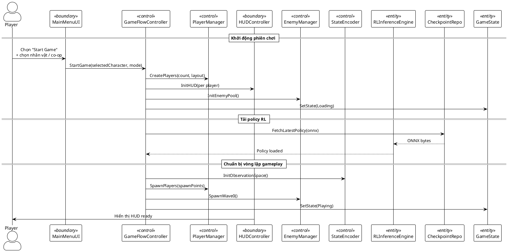
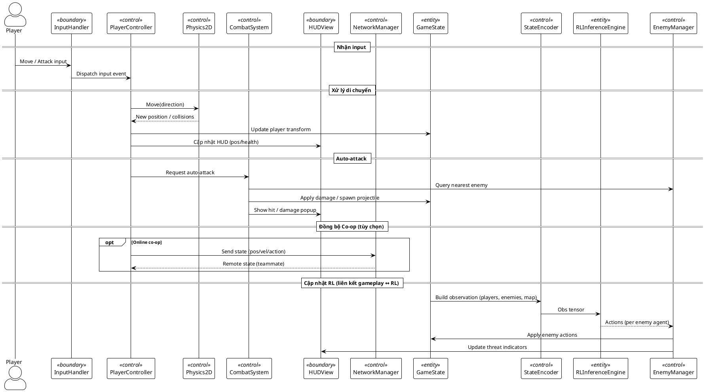
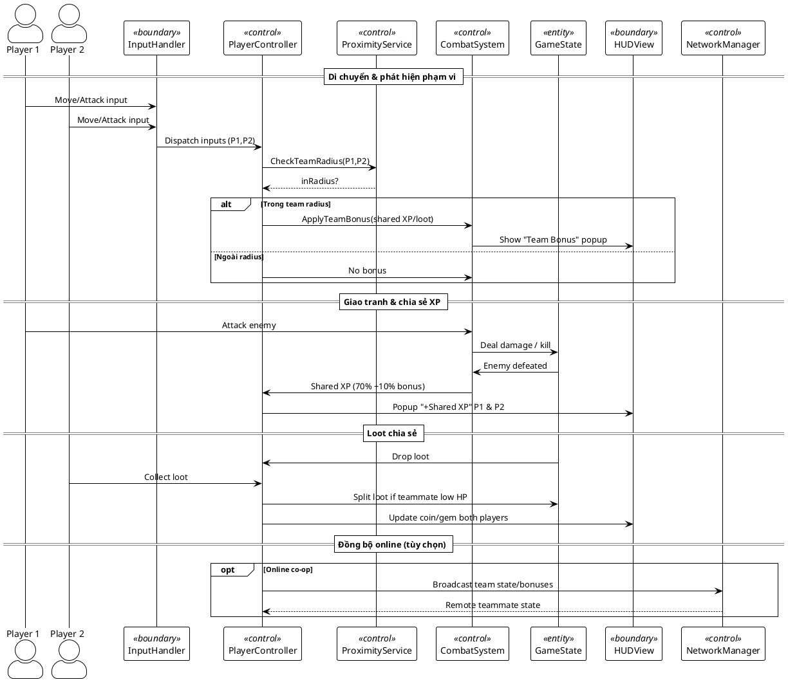
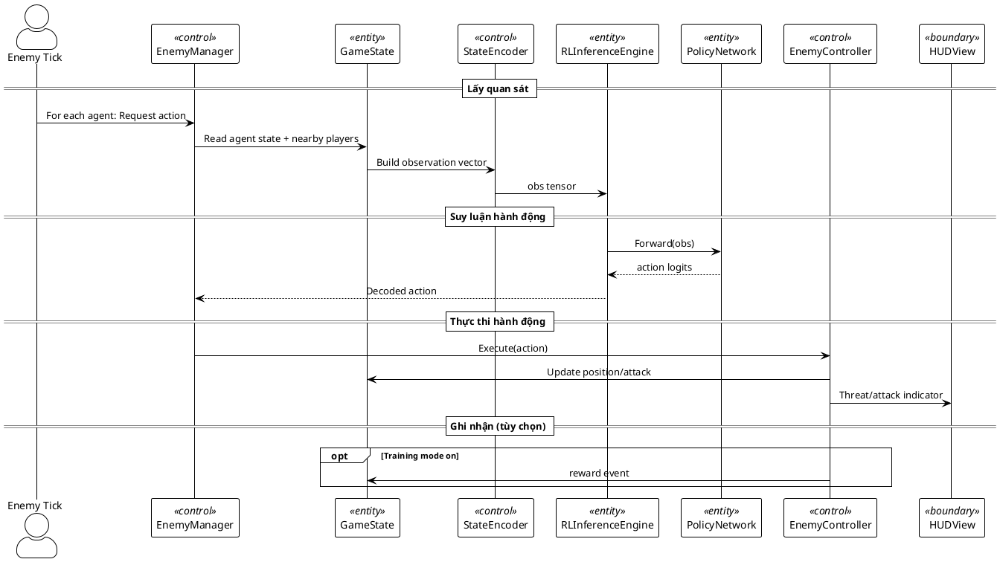
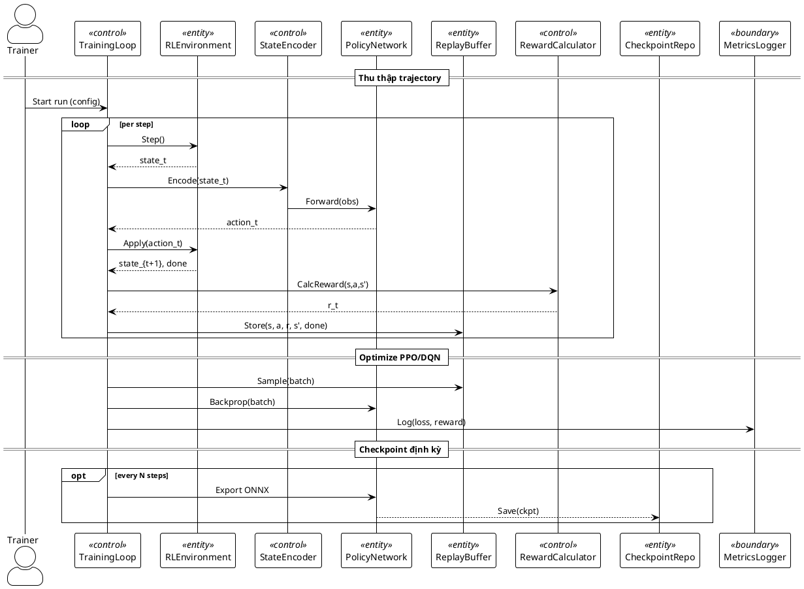

# 2.2. Thiết kế hệ thống (Co-op Survivors RL)

Mục tiêu: Thiết kế chi tiết bám sát kiến trúc phân lớp (Layered Architecture), Component-based (Unity), và MVC/MVVM cho UI đã lựa chọn ở Chương 1; làm rõ cách hình thành lớp, quan hệ, luồng dữ liệu giữa RL đa agent và gameplay co-op (multi-player), cùng các biểu đồ tuần tự cho từng use case trọng yếu.

## 2.2.1. Nguyên tắc thiết kế và ánh xạ kiến trúc

- Phân lớp 5 tầng: Presentation, Game Logic, AI & RL, Networking (tùy chọn), Data Persistence.
- Component-based: Hành vi gắn vào GameObject qua Component; các thành phần như `Monster`, `Player`, `RLMonster`, `RLEnvironment` là component.
- MVC/MVVM cho UI: View hiển thị; Controller/ViewModel xử lý tương tác và logic trình bày.
- Tách biệt rõ Boundary (lớp biên), Control (điều khiển), Entity (thực thể) trong mô hình phân tích/thiết kế.

## 2.2.2. Cơ sở hình thành lớp (phương pháp trích danh từ)

Áp dụng phương pháp trích danh từ từ yêu cầu (UC1–UC10) để xác định thực thể (Entity), biên (Boundary), điều khiển (Control):

- Thực thể (Entity) — các danh từ chính mô tả dữ liệu/đối tượng game:
  - Player, Monster, Environment, Reward, Experience, PolicyNetwork, Checkpoint, BehaviorProfile.
- Biên (Boundary) — các danh từ chỉ giao diện/tương tác:
  - GameUI, HUD, InputHandler, RLToolsUI.
- Điều khiển (Control) — các danh từ/động từ điều phối:
  - GameController, SpawnController, MonsterController, RLTrainingController, RLInferenceController, CheckpointController, MetricsController.

Kiểm tra quan hệ và lực lượng (multiplicity):

- Một `GameController` quản lý 1 `Environment`, 1 `Player`, và 0..\* `Monster`.
- `SpawnController` tạo 0..\* `Monster` theo thời gian.
- `RLInferenceController` sử dụng 1 `PolicyNetwork` để suy luận; `RLTrainingController` dùng 1 `Experience` buffer và cập nhật 1 `PolicyNetwork`.
- `CheckpointController` quản lý 0..\* `Checkpoint` phiên bản khác nhau.

## 2.2.3. Biểu đồ lớp (thiết kế) với stereotype và bội số

Hình 2.9: Class Diagram (Design) — Boundary, Control, Entity, với bội số và quan hệ đúng chuẩn UML.

Giải thích:

- Dùng `<<boundary>>`, `<<control>>`, `<<entity>>` để chỉ rõ vai trò lớp.
- Quan hệ và bội số (multiplicity) thể hiện thực tế thiết kế trong Unity.

## 2.2.4. RL ↔ Gameplay: Component & Data-Flow

Hình 2.10: Component Diagram — Luồng dữ liệu giữa module RL và gameplay.

Luồng dữ liệu chi tiết:

- Gameplay gửi trạng thái (EntityManager/Environment) → RL (StateEncoder) để tạo observation.
- RL suy luận hành động qua PolicyNetwork → ActionDecoder → trả về MonsterController.
- Gameplay thực thi hành động, tính Reward → RLTrainingController lưu transition.
- RLTrainingController huấn luyện định kỳ và CheckpointController lưu mô hình.

## 2.2.5. Biểu đồ tuần tự (Sequence) theo kiến trúc — từng use case

Lưu ý: Các participant được gán stereotype phù hợp (boundary/control/entity) để bám đúng kiến trúc.

### Hình 2.11: UC1 — Bắt đầu màn chơi

### Hình 2.12: UC2 — Di chuyển nhân vật

### Hình 2.13: UC3 — Hợp tác Co-op

### Hình 2.14: UC4 — Suy luận hành động RL (Inference Runtime)

### Hình 2.15: UC5 — Huấn luyện mô hình RL (Training Loop)

### Hình 2.17: UC9 — Lưu / tải model và checkpoint

### Hình 2.18: UC10 — Theo dõi hiệu năng & debug AI

## 2.2.6. Kết nối logic và tổ chức báo cáo

- Phần 2.2 tổ chức theo: (1) nguyên tắc thiết kế; (2) hình thành lớp; (3) biểu đồ lớp; (4) luồng dữ liệu RL↔Gameplay; (5) biểu đồ tuần tự cho từng use case.
- Tất cả tên lớp, module, use case khớp với phần 2.1.
- Quan hệ UML dùng đúng ký hiệu: association, composition (o--), dependency (-->), multiplicity (1, 0.._, 1.._).
- Các stereotype `<<boundary>>`, `<<control>>`, `<<entity>>` được áp dụng xuyên suốt để phản ánh kiến trúc.
