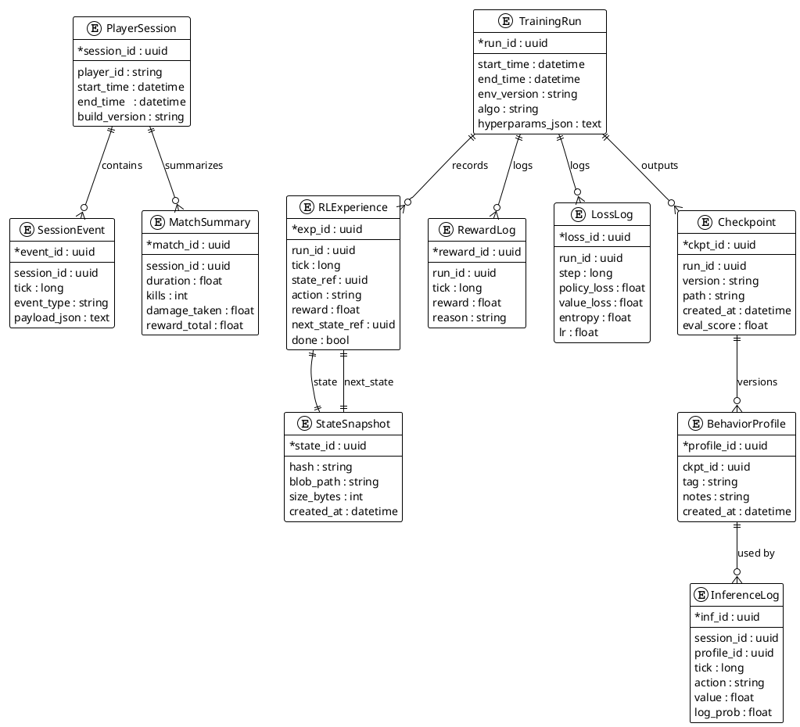
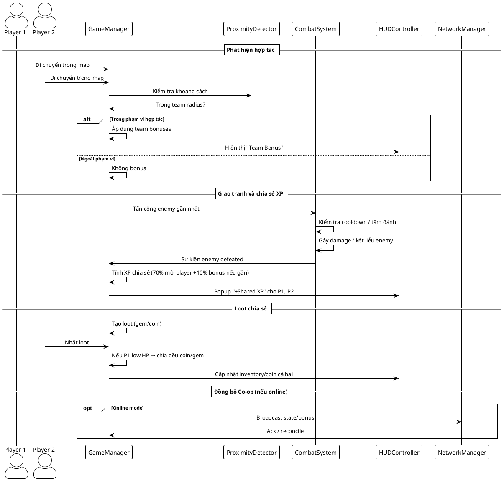

# 2.3. Cơ sở dữ liệu (Co-op Survivors RL)

Mục tiêu: Làm rõ cấu trúc và quan hệ giữa dữ liệu game co-op (runtime/telemetry multi-player) và dữ liệu RL đa agent (training/inference), gồm các bảng/collection chính, khóa, chỉ mục và cách đồng bộ với Unity/ML-Agents.

## 2.3.1. Nguyên tắc & mô hình dữ liệu

- Phân tách lớp dữ liệu (logical tiers):
  - **Gameplay runtime (telemetry/match log)**: phiên người chơi, sự kiện, tổng kết trận.
  - **RL training/inference**: experience tuples, loss/reward log, checkpoint, behavior profile.
- Bất biến vs phiên bản hóa:
  - **Bất biến**: SessionEvent, RLExperience, StateSnapshot (dùng hash kiểm toàn vẹn).
  - **Phiên bản hóa**: TrainingRun, Checkpoint, BehaviorProfile, Metrics (gắn version/seed).
- Định danh & truy vết:
  - Bắt buộc **session_id** cho gameplay và **run_id** cho training; mọi bảng log kèm timestamp/tick/step.
  - Chuẩn hóa timezone (UTC), định dạng ISO-8601; tick/step là số nguyên tăng.
- Tối ưu truy vấn & lưu trữ:
  - Log/experience dùng lưu trữ dạng hàng (row store); checkpoint/model dùng blob nhị phân kèm hash + size.
  - Chỉ mục khuyến nghị: (session_id, tick), (run_id, step), (run_id, version), (ckpt_id, created_at).
- Mức trừu tượng mô hình dữ liệu:
  - **Conceptual**: phiên chơi ↔ sự kiện ↔ tổng kết; run ↔ experience ↔ checkpoint ↔ profile ↔ inference log.
  - **Logical**: quan hệ ER với khóa ngoại; khóa tổng hợp (session_id, tick) cho log trình tự.
  - **Physical**: SQL (PostgreSQL) cho quan hệ; blob store (S3/disk) cho state/checkpoint; NoSQL tùy chọn cho truy vấn phân tích.
- Nhất quán giữa Unity và ML-Agents:
  - Unity ghi session_id/tick; Trainer ghi run_id/step; mapping profile_id ↔ ckpt_id để inference trong game.
  - Định dạng payload: JSON cho sự kiện; tensor/obs serialized (npz/pt) cho StateSnapshot; ONNX/pt cho model.
- Tuân thủ bảo mật và tối giản PII:
  - Pseudonym hóa player_id, tránh lưu PII; phân quyền đọc/ghi checkpoint và log.
  - Lưu vết audit: ai tạo checkpoint, khi nào, từ run_id nào.

## 2.3.2. Mô hình khái niệm & ERD

### Mô hình khái niệm

- **Miền Gameplay (telemetry/session):** PlayerSession → SessionEvent (dòng sự kiện thời gian) → MatchSummary (tổng kết trận).
- **Miền Training (RL run):** TrainingRun → {RLExperience, RewardLog, LossLog} → Checkpoint (phiên bản model) → BehaviorProfile (gắn nhãn rollout).
- **Miền Inference (runtime):** BehaviorProfile → InferenceLog (hành động/giá trị) gắn với PlayerSession để so sánh hiệu năng.
- **Trạng thái & quan sát:** RLExperience tham chiếu StateSnapshot (state, next_state) để tái tạo trajectory; snapshot lưu blob/feature vector sau encoder.
- **Định danh & liên kết:** session_id cho gameplay, run_id cho training; ckpt_id ↔ profile_id cho inference; tick/step + timestamp để đồng bộ thời gian.

### ERD (khái niệm, triển khai SQL/NoSQL tùy chọn)

## 2.3.3. Triển khai và lưu trữ

- SQL (PostgreSQL) phù hợp cho log cấu trúc và khóa ngoại; tạo index trên (session_id, tick), (run_id, step), (run_id, version).
- Blob store (S3/Local disk) cho StateSnapshot.blob_path và Checkpoint.path; lưu hash để kiểm tra toàn vẹn.
- Nếu dùng NoSQL (Mongo/Elastic), giữ các trường khóa (session_id, run_id, tick) để truy vấn; vẫn nên tách collection cho experience và inference log.

## 2.3.4. Đồng bộ với Unity/ML-Agents

- Runtime Unity ghi SessionEvent và MatchSummary qua Job/Coroutines; flush định kỳ để tránh mất dữ liệu.
- ML-Agents Trainer ghi RLExperience, RewardLog, LossLog; checkpoint lưu theo version kèm eval_score.
- Inference trong game chọn BehaviorProfile (theo ckpt) và log InferenceLog để so sánh hiệu năng giữa các profile.

## 2.3.5. Quản trị và vòng đời dữ liệu

- TTL/archiving: log chi tiết (SessionEvent, RLExperience) đặt TTL sau X ngày; Checkpoint/BehaviorProfile giữ lại bản tốt nhất (eval_score cao).
- Phiên bản hóa: TrainingRun và Checkpoint versioning giúp tái hiện thí nghiệm; lưu hyperparams và seed.
- Bảo mật: mã hóa đường dẫn blob; ẩn player_id hoặc thay bằng hash cho dữ liệu nhạy cảm.

## Phụ lục: Biểu đồ tuần tự UC3 - Hợp tác Co-op

