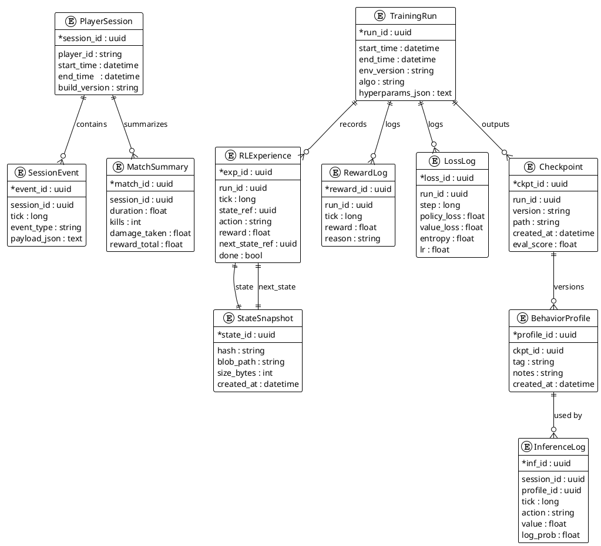

# 2.3. Cơ sở dữ liệu

Mục tiêu: Làm rõ cấu trúc và quan hệ giữa dữ liệu game (runtime/telemetry) và dữ liệu RL (training/inference), gồm các bảng/collection chính, khóa, chỉ mục và cách đồng bộ với Unity/ML-Agents.

## 2.3.1. Nguyên tắc thiết kế dữ liệu

- Phân tách nguồn: dữ liệu game (telemetry, match log) tách khỏi dữ liệu RL (experience, checkpoint, metrics).
- Bất biến vs biến đổi: log trận đấu và experience là bất biến; model/metrics/behavior profile là phiên bản hóa.
- Gắn khóa thời gian (timestamp) và phiên (session_id/run_id) cho mọi bản ghi để truy vết.
- Ưu tiên lưu dạng hàng (row) cho log/experience; dạng tệp nhị phân cho checkpoint/model.

## 2.3.2. Lược đồ quan hệ (ER)

Các thực thể chính và quan hệ (mang tính khái niệm, có thể triển khai bằng SQL hoặc NoSQL):

- PlayerSession(session_id PK, player_id, start_time, end_time, build_version)
  - 1..\* SessionEvent
  - 1..\* MatchSummary
- SessionEvent(event_id PK, session_id FK, tick, event_type, payload_json)
  - Lưu input, spawn, damage, pickup, v.v.
- MatchSummary(match_id PK, session_id FK, duration, kills, damage_taken, reward_total)
- RLExperience(exp_id PK, run_id FK, tick, state_ref, action, reward, next_state_ref, done)
  - 1..1 StateSnapshot (state_ref)
  - 1..1 StateSnapshot (next_state_ref)
- StateSnapshot(state_id PK, hash, blob_path, size_bytes, created_at)
  - Lưu serialized observation hoặc feature vector sau encoder.
- RewardLog(reward_id PK, run_id FK, tick, reward, reason)
- TrainingRun(run_id PK, start_time, end_time, env_version, algo, hyperparams_json)
  - 1..\* LossLog
  - 1..\* RLExperience
  - 1..\* RewardLog
  - 1..\* Checkpoint
- LossLog(loss_id PK, run_id FK, step, policy_loss, value_loss, entropy, lr)
- Checkpoint(ckpt_id PK, run_id FK, version, path, created_at, eval_score)
- BehaviorProfile(profile_id PK, ckpt_id FK, tag, notes, created_at)
- InferenceLog(inf_id PK, session_id FK, profile_id FK, tick, action, value, log_prob)

Quan hệ chính:

- PlayerSession 1.._ SessionEvent, 1.._ MatchSummary.
- TrainingRun 1.._ RLExperience, 1.._ LossLog, 1.._ RewardLog, 1.._ Checkpoint.
- Checkpoint 1.._ BehaviorProfile; BehaviorProfile 1.._ InferenceLog.
- RLExperience liên kết 2 StateSnapshot (state, next_state) để tái tạo trajectory.

## 2.3.3. Sơ đồ PlantUML (ERD)

## 2.3.4. Triển khai và lưu trữ

- SQL (PostgreSQL) phù hợp cho log cấu trúc và khóa ngoại; tạo index trên (session_id, tick), (run_id, step), (run_id, version).
- Blob store (S3/Local disk) cho StateSnapshot.blob_path và Checkpoint.path; lưu hash để kiểm tra toàn vẹn.
- Nếu dùng NoSQL (Mongo/Elastic), giữ các trường khóa (session_id, run_id, tick) để truy vấn; vẫn nên tách collection cho experience và inference log.

## 2.3.5. Đồng bộ với Unity/ML-Agents

- Runtime Unity ghi SessionEvent và MatchSummary qua Job/Coroutines; flush định kỳ để tránh mất dữ liệu.
- ML-Agents Trainer ghi RLExperience, RewardLog, LossLog; checkpoint lưu theo version kèm eval_score.
- Inference trong game chọn BehaviorProfile (theo ckpt) và log InferenceLog để so sánh hiệu năng giữa các profile.

## 2.3.6. Quản trị và vòng đời dữ liệu

- TTL/archiving: log chi tiết (SessionEvent, RLExperience) đặt TTL sau X ngày; Checkpoint/BehaviorProfile giữ lại bản tốt nhất (eval_score cao).
- Phiên bản hóa: TrainingRun và Checkpoint versioning giúp tái hiện thí nghiệm; lưu hyperparams và seed.
- Bảo mật: mã hóa đường dẫn blob; ẩn player_id hoặc thay bằng hash cho dữ liệu nhạy cảm.
