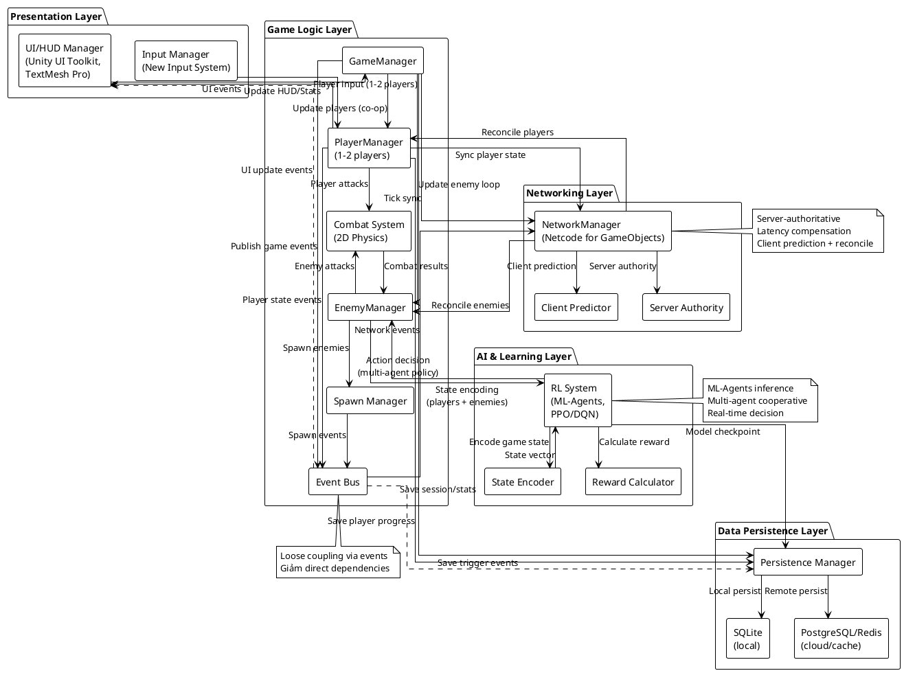

# Component Interaction Diagram

```plantuml
@startuml Component Interaction
!theme plain
skinparam componentStyle rectangle
skinparam linetype ortho

package "Presentation Layer" {
    component [UI/HUD Manager\n(Unity UI Toolkit,\nTextMesh Pro)] as UI
    component [Input Manager\n(New Input System)] as Input
}

package "Game Logic Layer" {
    component [GameManager] as GM
    component [PlayerManager\n(1-2 players)] as PM
    component [EnemyManager] as EM
    component [Spawn Manager] as Spawn
    component [Combat System\n(2D Physics)] as Combat
    component [Event Bus] as EventBus
}

package "AI & Learning Layer" {
    component [RL System\n(ML-Agents,\nPPO/DQN)] as RL
    component [State Encoder] as Encoder
    component [Reward Calculator] as Reward
}

package "Networking Layer" {
    component [NetworkManager\n(Netcode for GameObjects)] as Net
    component [Client Predictor] as Predictor
    component [Server Authority] as Server
}

package "Data Persistence Layer" {
    component [Persistence Manager] as Persist
    database [SQLite\n(local)] as SQLite
    database [PostgreSQL/Redis\n(cloud/cache)] as Cloud
}

' Core game loop coordination
GM --> PM : "Update players (co-op)"
GM --> EM : "Update enemy loop"
GM --> EventBus : "Publish game events"

' Input and UI
Input --> PM : "Player input (1-2 players)"
UI <-- PM : "Update HUD/Stats"
UI --> GM : "UI events"

' Player management
PM --> Combat : "Player attacks"
PM --> EventBus : "Player state events"
PM --> Net : "Sync player state"

' Enemy AI coordination
EM --> RL : "State encoding\n(players + enemies)"
RL --> Encoder : "Encode game state"
RL <-- Encoder : "State vector"
RL --> Reward : "Calculate reward"
RL --> EM : "Action decision\n(multi-agent policy)"

' Enemy spawn and combat
EM --> Spawn : "Spawn enemies"
EM --> Combat : "Enemy attacks"
Spawn --> EventBus : "Spawn events"
Combat --> EM : "Combat results"

' Network synchronization
Net --> PM : "Reconcile players"
Net --> EM : "Reconcile enemies"
Net --> Predictor : "Client prediction"
Net --> Server : "Server authority"
EventBus --> Net : "Network events"
GM --> Net : "Tick sync"

' Persistence
Persist --> SQLite : "Local persist"
Persist --> Cloud : "Remote persist"
GM --> Persist : "Save session/stats"
RL --> Persist : "Model checkpoint"
PM --> Persist : "Save player progress"

' Event-driven communication
EventBus ..> UI : "UI update events"
EventBus ..> Persist : "Save trigger events"

note right of RL
  ML-Agents inference
  Multi-agent cooperative
  Real-time decision
end note

note right of Net
  Server-authoritative
  Latency compensation
  Client prediction + reconcile
end note

note bottom of EventBus
  Loose coupling via events
  Giảm direct dependencies
end note

@enduml
```
